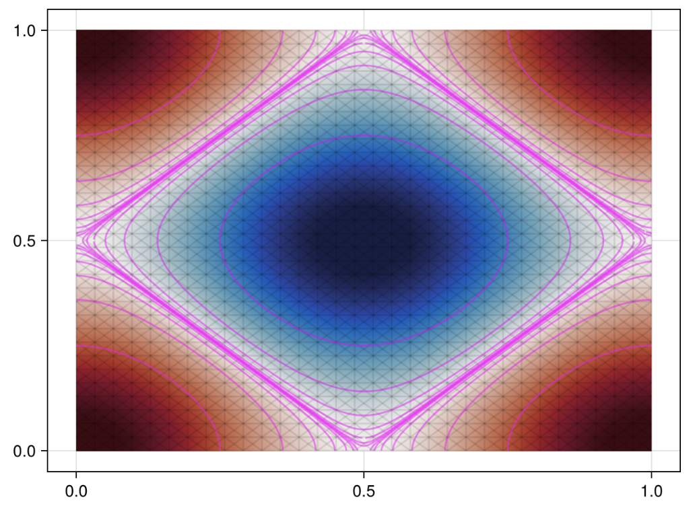
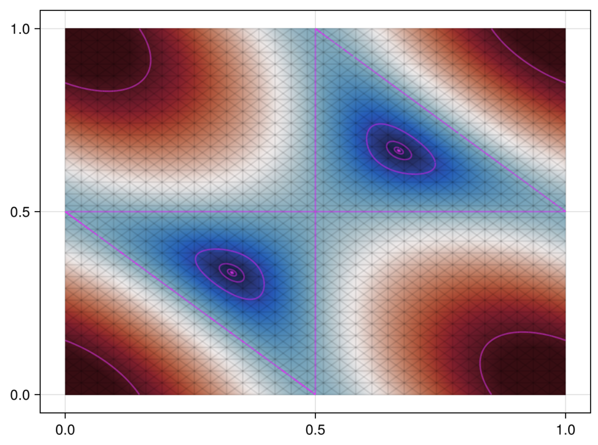
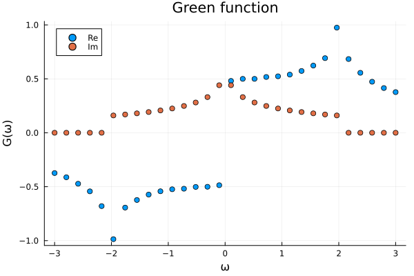
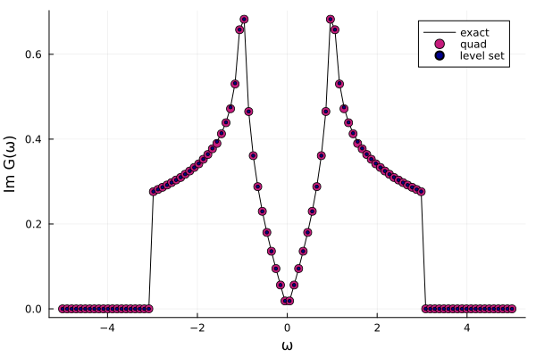
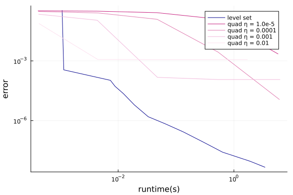

# LevelSetIntegrate

This code is written by Phum (Gene) Siriviboon.

## Problem Statement
Calculate the integration of the form
$$I = \int_V d{x} \frac{p({x})}{q({x}) + i 0^+}.$$
Assuming that the singularity on the integrand only emerges due to zeros of $q(x)$

## Introduction

using an identity $\frac{1}{x+i0^+} = \mathcal{P} \frac{1}{x} - i \pi \delta(x)$, we can see that 
$${\rm Re} \, I = \mathcal{P} \int_V  d{x} \, \frac{p({x})}{q({x})},$$
$${\rm Im} \, I =  - \pi \int_V  d{x} \, \delta(q({x})) p({x}).$$

which can also be rewitten as 

$${\rm Re} \, I = \mathcal{P} \int \frac{dc}{c} \int_{q(x(t)) = c} dx(t)  \, \frac{p(x(t))}{|\nabla q(x(t))|},$$ 

$${\rm Im} \, I =  - \pi \int_{q(x(t)) = 0} dx(t)  \, \frac{p(x(t))}{|\nabla q(x(t))|}.$$

We can see that for both the real and imaginary part, the integrand is concentrated near $q({x}) = 0$ which would result in major contribution of the integral. Here, we propose the following scheme.

## Initial mesh subsampling [Getting Level set]
Here we outline the algorithm for the initial mesh subsampling

1. Initiate a mesh e.g. $2\times N\times N$  triangular grid
2. Calculate $q({x})$ for every vertices of the meshes
3. Label every triangles with subsample tags
4. Iterate through the faces with following
- For triangle ${x}{y}{z}$ calculate $q_x = q({x}), q_y =  q({y}), q_z =  q({z})$
- If three of the function are zero label the face with subsample tag
- If two of $q_i$ are zero or $q_i q_j < 0$, tag the triangle with singularity tag and test the following
    - consider edge i, j: find midpoint k if $|q_k - (q_i + q_j)/2| > l_{ij} \varepsilon$ where $l_{ij}$ are the distance between i andj, label the triangle with subsample tag
- Else, remove the subsample tags
5. Subsample on all the triangles with the subsample tag. 
6. Repeat 3 and 4 for $n$ times or until run out of subsampled tag

## Integration 

### Imaginary Part

1. For each triangle, find zero using k-step newton-raphson method and return edge(s) ij
2. Approximate $|\nabla q(x)|$ with finite difference method and linear interpolation
3. Integrate $p(x)/|\nabla q(x)|$ along ij using adaptive trapeziod rule

### Real parts

1. For each triangle, find $q(x) = c$ using k-step newton-raphson method and return edge(s) ij
2. Approximate $|\nabla q(x)|$ for each faces with finite difference method 
3. Integrate $p(x)/|\nabla q(x)|$ along ij using adaptive trapeziod rule and set to $F(c)$
4. Integrate $\int d \ln(c) \, F(c)$ using adaptive trapeziodal rule

## Results and Bachmarking

### Level set i.e. Fermi Level

*Square Lattice*

*Graphene Band (with linear transformation)*

### Density of state

*DOS of square lattice*

*graphene DOS computed using exact, level set method, and quadruture method*

### Benchmarking

Here we compute the density of state of graphene band at $\omega = 2.0$ and compare the result with the 2d quadruture rule using error as a function of runtime as metric. 

